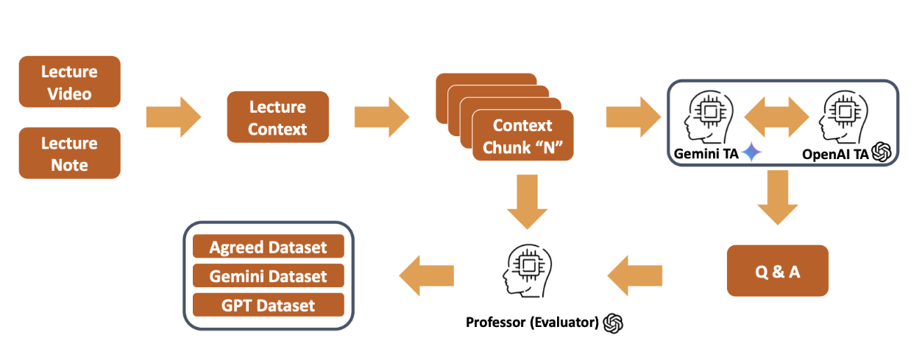
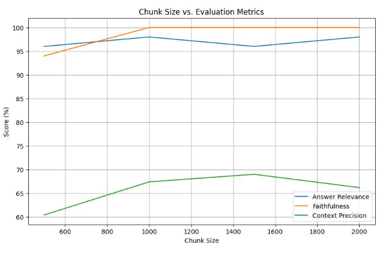
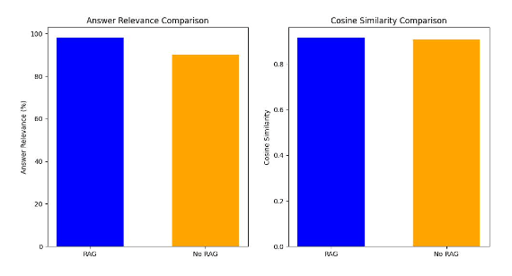

# Building a Retrieval-Augmented Generation (RAG) System for Course Material Question-Answering

## Overview
This project implements a Retrieval-Augmented Generation (RAG) pipeline designed to answer domain-specific questions based on university-level machine learning course materials. The system ingests lecture transcripts and LaTeX-formatted course notes to answer student queries with high precision.

To address the lack of domain-specific benchmarks, we developed the **Dhillon ML Dataset**, an automated evaluation framework utilizing Multi-Agent LLMs (Student, TA, and Professor agents) to synthetically generate and adjudicate Ground Truth Q&A pairs.

## Architecture

The pipeline leverages **LangChain** for orchestration, **ChromaDB** for vector storage, and **Google Gemini 2.0 Flash** for response generation.

*Figure 1: Overview of the RAG Pipeline involving Data Loading, LaTeX Chunking, Embedding, and Generation*
### Core Components
* **Data Ingestion:** Processes heterogeneous data sources including raw video transcripts and handwritten notes converted to LaTeX using GPT-4o.
* **Custom Chunking:** Implements `LatexTextSplitter` and `RecursiveCharacterTextSplitter` to preserve mathematical notation and contextual integrity across boundaries.
* **Vector Database:** Stores dense vector embeddings using **ChromaDB** to enable semantic similarity search.
* **Generator:** Utilizes **Gemini 2.0 Flash** via VertexAI for its strong reasoning capabilities in mathematical contexts.

## Automated Evaluation Pipeline (Dhillon ML Dataset)

Evaluating RAG systems in educational settings is challenging due to the lack of labeled data. We proposed an agentic workflow to automate this process.

*Figure 2: The Dataset Generation Pipeline using Gemini and GPT-based TA agents and a Professor Evaluator agent1.*
**Context Extraction:** Lecture materials are segmented into manageable chunks.
**Generation Agents (TA):** Independent agents (Gemini 2.0 and GPT-4o-mini) generate candidate Question-Answer pairs from the context.
**Evaluator Agent (Professor):** A GPT-4o-based "Professor" agent reviews candidate pairs to curate a high-quality "Agreed Dataset" for benchmarking# Performance & Benchmarks.

We conducted extensive ablation studies to optimize chunk size, embedding models, and retrieval strategies.

### 1. Chunk Size Optimization
We analyzed the impact of chunk size (500 to 2000 tokens) on **Answer Relevance**, **Faithfulness**, and **Context Precision**. Results indicate that a chunk size of approximately 1000 tokens achieves the optimal balance, maximizing relevance while maintaining high precision.

*Figure 3: Impact of Chunk Size on RAG Evaluation Metrics*
### 2. RAG vs. No-RAG
Implementing the RAG retrieval mechanism improved **Answer Relevance** from ~90% to nearly 100% compared to standard LLM prompting, while also improving semantic cosine similarity.

*Figure 4: Comparison of Question Answering Performance With and Without RAG*
### 3. Embedding Model Comparison
We benchmarked **Google VertexAI (text-embedding-004)** against **OpenAI (text-embedding-3-large)**.
* **VertexAI** demonstrated higher semantic retrieval accuracy (Cosine Similarity: 92.4% vs 85.8%).
* **OpenAI** displayed marginally better context precision (77.6% vs 75.6%).

*Figure 5: Performance comparison across different embedding models*

## Tech Stack

* **LLMs:** Google Gemini 2.0 Flash, OpenAI GPT-4o-mini.
* **Orchestration:** LangChain, LangGraph.
* **Embeddings:** Google VertexAI (`text-embedding-004`), OpenAI (`text-embedding-3-large`).
* **Vector Store:** ChromaDB.
* **Metrics:** Answer Relevance, Faithfulness, Context Precision, Semantic Similarity.

## Contributors
* Atharva Kalamkar
* Minkyu Choi
* Mir Mohammad Shamszadeh
* Tiffany Hong